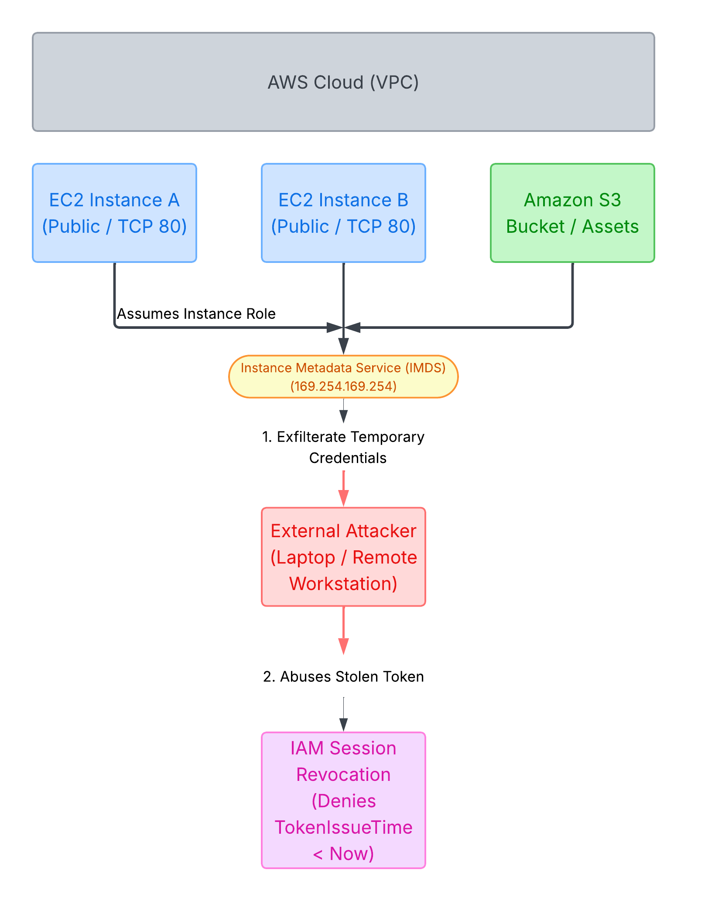

# AWS Incident Response: Mitigating Stolen IAM Session Credentials

## Project Overview

This project demonstrates an end-to-end AWS security breach and incident response remediation workflow. A public-facing EC2 instance operated by **Animals4Life (A4L)** is compromised via a web application vulnerability. The attacker queries the Instance Metadata Service (IMDS) to exfiltrate temporary IAM role credentials and uses them externally from a remote workstation to perform reconnaissance and access AWS resources (S3, EC2).

The remediation phase demonstrates how to invalidate stolen temporary credentials in real time using an **IAM Session Revocation Policy** (`aws:TokenIssueTime`) without deleting the underlying IAM role or disrupting long-term application permissions.

---

## Architecture & Threat Vector Map



*Figure 0: Concept map highlighting the trust boundary, IMDS exfiltration path, external threat vector, and IAM session revocation control.*


---

## Technical Scenario & Key Concepts

* **Infrastructure Context:** A4L operates thousands of web servers using standard HTTP (TCP/80). All instances use IAM instance roles rather than hardcoded credentials to access AWS services.
* **Attack Scenario:** An attacker gains shell access on EC2 Instance A and abuses IMDS (`169.254.169.254`) to steal the temporary security credentials generated for `A4L-InstanceRole-RIaDr3ApCGWx`.
* **Incident Response Dilemma:**
* - Deleting the IAM Role breaks all thousands of web servers relying on it.
* - Deleting attached permissions policies leaves web servers functional but unable to access required AWS resources.


* **Solution:** Revoking active sessions applies an inline deny policy targeting credentials issued **prior** to the breach timestamp using `aws:TokenIssueTime`.

---

## Lab Execution & Evidence

### Step 1: Infrastructure Provisioning

Deployed the environment using AWS CloudFormation template `A4LHostingInc.yaml`. This created two public EC2 instances (`A4L-HostingA` and `A4L-HostingB`) equipped with the necessary IAM instance profile.


*Figure 1: Provisioning the A4L stack via CloudFormation.*


*Figure 2: Verification of launched EC2 instances (`A4L-HostingA` and `A4L-HostingB`).*

---

### Step 2: Session Manager & Target Access

Connected to `A4L-HostingA` using AWS Systems Manager (SSM) Session Manager to simulate gaining shell access via an application vulnerability.


*Figure 3: Connecting to the target EC2 instance through SSM Session Manager.*

---

### Step 3: Credential Exfiltration via IMDS

Using shell access, executed cURL requests against the local Instance Metadata Service (IMDS) endpoint (`[http://169.254.169.254](http://169.254.169.254)`) to identify the attached IAM role and extract temporary credentials:

```bash
# Get attached IAM role name
curl http://169.254.169.254/latest/meta-data/iam/security-credentials/

# Retrieve temporary Access Key ID, Secret Key, and Session Token
curl http://169.254.169.254/latest/meta-data/iam/security-credentials/A4L-InstanceRole-RIaDr3ApCGWx

```


*Figure 4: Querying IMDS to discover the role name `A4L-InstanceRole-RIaDr3ApCGWx`.*


*Figure 5: Exfiltrating `AccessKeyId`, `SecretAccessKey`, `Token`, and expiration timestamp.*

---

### Step 4: Unauthorized External Access & Reconnaissance

Transferred the exfiltrated session keys to a local Windows workstation (outside the AWS environment) and configured environment variables:

```cmd
SET AWS_ACCESS_KEY_ID=ASIAWY...
SET AWS_SECRET_ACCESS_KEY=0Uompx...
SET AWS_SESSION_TOKEN=IQoJb...

```

#### Verification & Infrastructure Enumeration:

Executed AWS CLI commands from the local command prompt (`C:\Windows\System32>`) to confirm identity and map out active environment resources:

```cmd
# Verify identity of the stolen session token
aws sts get-caller-identity

# Enumerate running EC2 instances across the region
aws ec2 describe-instances --region us-east-1

# Inspect S3 storage assets
aws s3 ls

```


*Figure 6: External verification showing assumed role identity via `aws sts get-caller-identity`.*


*Figure 7: Attacker mapping infrastructure via `aws ec2 describe-instances`.*


*Figure 8: Successful S3 bucket listing from local Windows command prompt using stolen credentials.*

---

### Step 5: Incident Response & Session Revocation

To stop the breach immediately without impacting underlying role definitions across other production workloads:

1. Navigated to **IAM Console** $\rightarrow$ **Roles** $\rightarrow$ **`A4L-InstanceRole-RIaDr3ApCGWx`**.
2. Opened the **Permissions** tab to review attached policies.
3. Switched to the **Revoke sessions** tab and executed **Revoke active sessions**.


*Figure 9: Navigating to the compromised IAM Role's Permissions tab in the console.*


*Figure 10: Executing Revoke Active Sessions to attach the `AWSRevokeOlderSessions` inline policy.*

#### Policy Structure Applied:

```json
{
  "Version": "2012-10-17",
  "Statement": [
    {
      "Effect": "Deny",
      "Action": "*",
      "Resource": "*",
      "Condition": {
        "DateLessThan": {
          "aws:TokenIssueTime": "2026-08-31T11:10:00Z"
        }
      }
    }
  ]
}

```

---

### Step 6: Remediation Verification

Re-attempted AWS CLI operations from the external Windows command prompt using the stolen credentials:

```cmd
aws s3 ls

```

**Result:**

Access was blocked immediately with an explicit `AccessDenied` error message.


*Figure 11: Proof of remediation — stolen credentials return an explicit AccessDenied error.*

---

## Key Security Takeaways

1. **Immediate Blast Radius Control:** Revoking sessions via `aws:TokenIssueTime` neutralizes stolen credentials instantly without deleting shared IAM roles or altering long-term infrastructure permissions.
2. **Instance Recovery:** Legitimate EC2 instances affected by session revocation regain access by restarting the instance (or refreshing the session profile), forcing IMDS to issue a new token dated after the revocation timestamp.
3. **Defense-in-Depth:** Enforcing **IMDSv2** (requiring session tokens via `PUT` requests) prevents SSRF vulnerabilities from reaching metadata endpoints in the first place.

---

## Acknowledgments
* Lab scenario inspired by cloud training architecture provided by [Adrian Cantrill (learn.cantrill.io)](https://learn.cantrill.io/).
